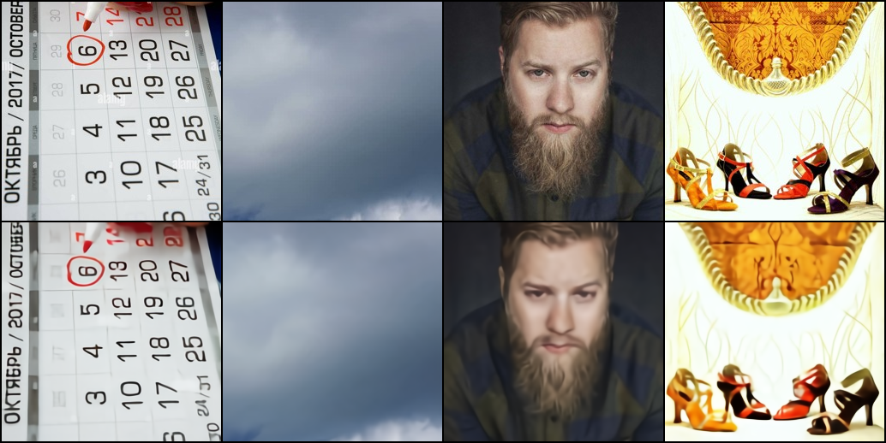
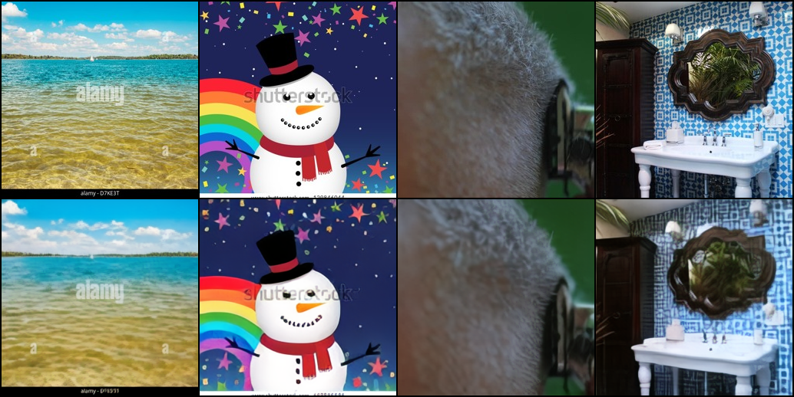

## VAE-VQ
Custom VAE VQ implementation trained from scratch, on Conceptual Captions dataset

## Properties:
Size: 306MB
Numer latents: 1024
Vocab size: 8192
Size of latents: 64-64
Loss: ~0.07

## Compression
from 128x128 image to 256 (16*16) indecies

## Samples:

Fell free to use it!
Model is in huggingface: firdavsus/text2Image
